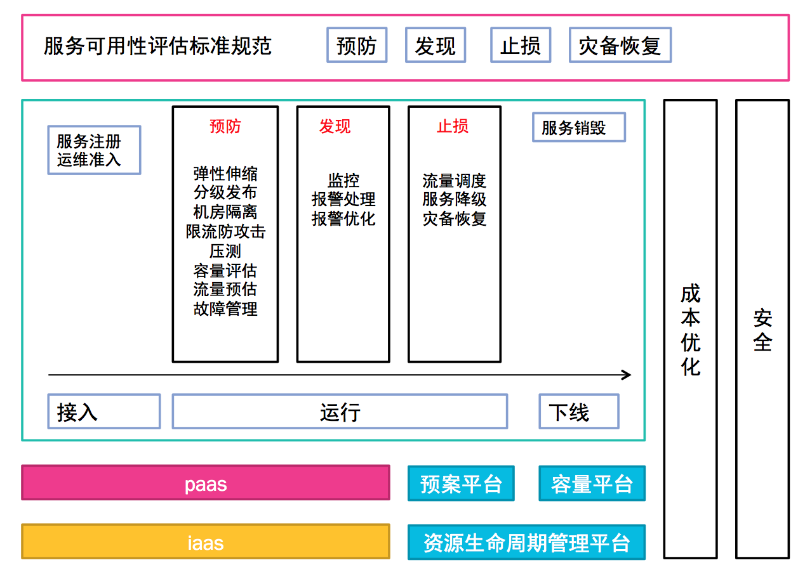

# 中小型业务运维特点
中小型业务定义：机器规模在1w台以下的服务，或rd团队在500人以下的服务

## 特点1:服务复杂度高，导致业务运维成本大
* 服务模块多
* 大量新业务涌现，无机器预算、无人力投入
* 业务多处于上升期或者稳定发力期，变更迭代速度快，每周上线单数量几百个，导致稳定性风险高
* 业务依赖大量第三方组件，包括mysql、xdb、消息队列、反作弊组件等
* 各业务无统一指导，运维经验依靠口口相传的方式传承，无文档规范

## 特点2:运维投入相对较少，稳定性压力大
* 大量业务达不到基本运维准入要求，当前的运维状态也达不到要求
* 大量的核心模块处于rd的不规范自运维状态，稳定性故障频发
* 业务生存周期不固定，模块产生与消亡变化频繁，无完整的生命周期管理

## 特点3:部分业务有活动保障需求
* 活动期间流量会增加数倍，给稳定性和成本带来很大的压力

# 解决思路
* 制定规范
	* 预防、发现、止损、灾备恢复
* 自动化
	* 基础运维服务重复操作改为自助,对业务需求进行抽象，监控、变更、容量、预案流程化执行,故障定位、故障自愈	 
* 平台化
	* 服务上云
	* 对业务进行抽象，不断进化paas、iaas

# 技术方案全景图

下面将会按照章节逐步展开讲解
